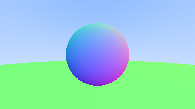
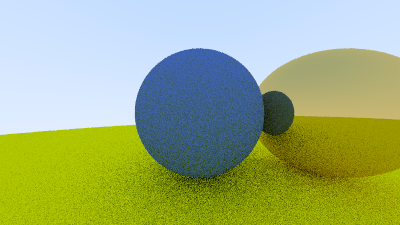

# Mini Renderer (C++)

A small, production-style CPU ray/path tracer written in modern C++. This project was built as a focused graphics engineering exercise: clean architecture, correct ray–geometry intersections, a minimal material system, and image output suitable for iteration and debugging.

The renderer currently supports spheres, diffuse and metallic materials, anti-aliasing via multi-sampling, and recursive ray scattering to produce soft indirect lighting.

---

## Features

- **Ray–sphere intersection** with nearest-hit selection
- **Surface normal orientation** via `front_face` and `set_face_normal`
- **Scene abstraction**
    - `Hittable` interface
    - `Sphere` primitive
    - `HittableList` world container
- **Camera** abstraction (separate ray generation from rendering logic)
- **Materials**
    - `Lambertian` (diffuse)
    - `Metal` (specular reflection + fuzz)
- **Anti-aliasing** with multi-sample per pixel jitter
- **Recursive ray scattering** (path tracing style) with max depth
- **PPM output** (easy-to-debug image output format)

---

## Project Structure

```text
mini-renderer/
  CMakeLists.txt
  include/
    core/
      Vec3.h
      Ray.h
      Camera.h
      (Random utilities if used)
    geometry/
      Hittable.h
      Sphere.h
      HittableList.h
    shading/
      Material.h
      Lambertian.h
      Metal.h
  src/
    core/
      Camera.cpp
    main.cpp
  output/
   sphere.ppm
   sphere_with_metal_scatter.ppm](output/sphere_with_metal_scatter.ppm)(renders go here)
```
# Build & Run
## Prerequisites

CMake (3.20+ recommended)

A C++20 compiler toolchain (MinGW/clang/MSVC)

Build (out-of-source)

From the project root:
```bash
cmake -S . -B build
cmake --build build --config Release
```
Run
```bash 
.\build\bin\Release\Mini_Renderer.exe --width 500 --spp 15 --out test.png
```

Depending on your generator, the executable location can differ.

Example (Visual Studio multi-config):

## Output Screenshots 
- 
- 

